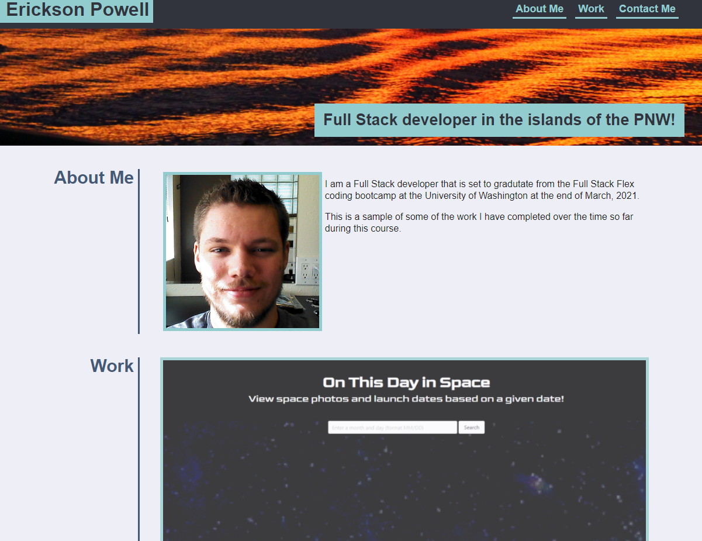

# u08-portfolio-update
A portfolio built with HTML/CSS for Homework 8 of UW's FSF bootcamp.

## Description
This is an updated version of the mock portfolio from my second assignment af UW's bootcamp.

I have updated it to use real information, and projects I have done over the past two months.

[Deployed Project](https://epowelldev.github.io/u08-portfolio-update/ "Portfolio")