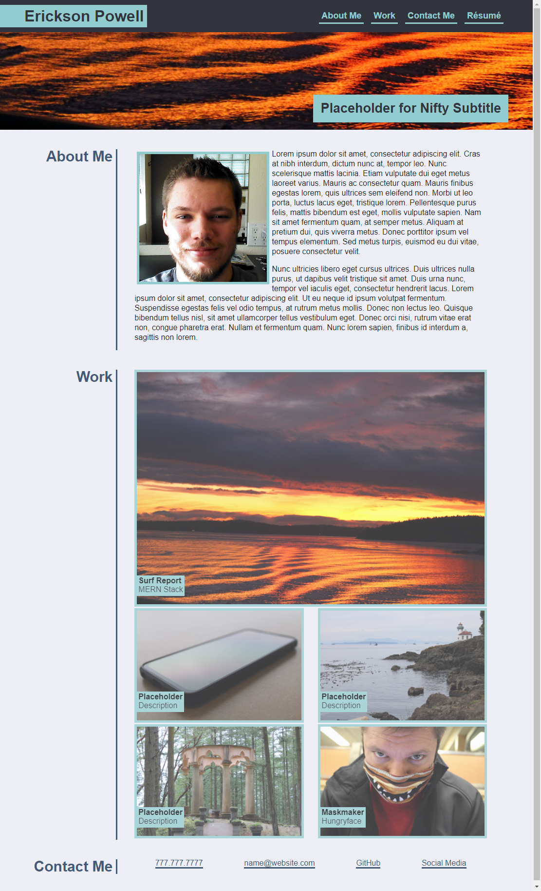

# sample-portfolio-u02
A sample portfolio built with HTML/CSS for unit 02 of Full Stack Flex bootcamp

## Description
This project was a from-scratch recration of a mock portfolio. Using flexbox to make a responsive website, I ran into struggles with the deeper concepts of flexbox.

## Flow of Work
For the first half of the week I had been beating my head against a wall trying to understand why flexbox wasn't working as I thought it would. I felt like all my old float methods were much easier to understand and utilize.

Part of me still thinks that.

The last hours before submission I realized that my thoughts about how flexbox operated were incorrect, and I started reworking my CSS and HTML structure. I finally got it working.

I restarted my CSS at least once, and reverted at least once during this crazy dev cycle.

There are still plenty of placeholders for me to come back and update once projects and other items are established.

I still need much practice in commenting throughout my css and html.

[Deployed Project](https://epowelldev.github.io/sample-portfolio-u02/ "Portfolio")